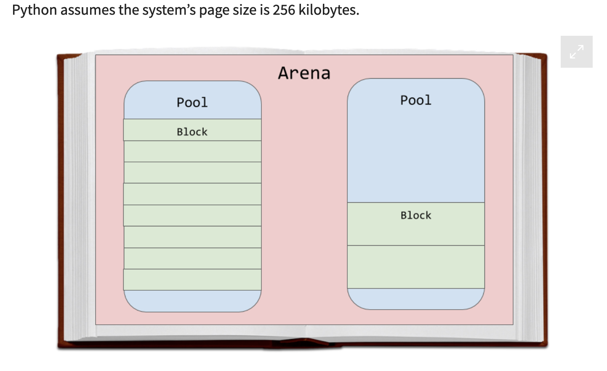
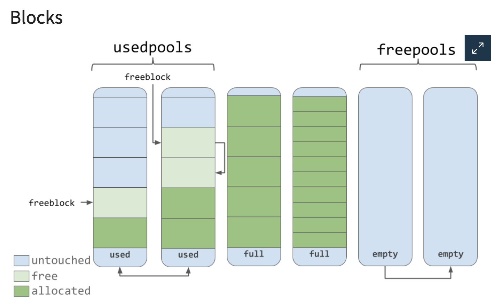
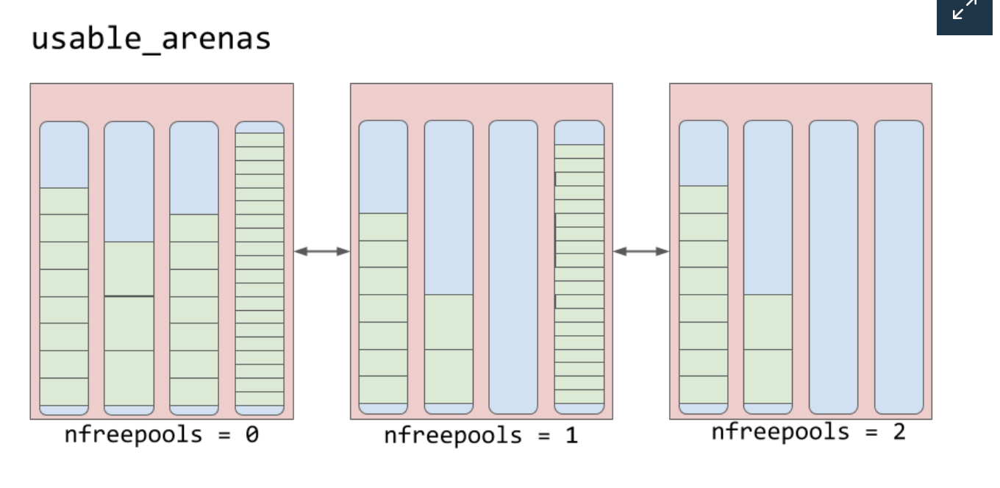

# Memory Management

Link : https://favtutor.com/blogs/delete-variable-python

## Variable memory allocation

Variables are **references** to the actual objects which hold the given value. That's why in Python we don't have to
**declare the variables** or their **data types** before using them.

While working with Python, there are two types of memory:
1. Static Memory
2. Dynamic Memory

Python uses **dynamic memory allocation**, i.e. memory allocation occurs during runtime. The dynamic memory allocation
uses a **Heap data structure** for implementation. Besides heap data structure, the Stack data structure is used to store
the static memory. Here, static memory refers to the function call stack.

When we declare a variable in Python, **it creates an object in the Private Heap Space** that stores the variable's value. While 
the **variable gets created in the Stack memory as a reference** to the said object.

```python
a = b = c = 10
del c # Only variable c will be deleted. a and b will be intact. 
```

Python has a Python memory manager, which is responsible for the **allocation or de-allocation of the memory heap**. The memory 
Heap in Python holds the objects and other data structures used in the program.

So, when a variable (a reference to an object) is no longer in use, the Python memory manager frees up the space, i.e. it removes 
the unnecessary object. This process of removing objects, which are no longer in use, is known as **Garbage Collection**. 
This process runs on a regular basis and reclaims memory space from objects that are no longer needed by the program. 

As you know, the **dir()** method returns the all properties and methods of a specified object. Even when no object is 
referenced, it returns a list of all the variables and built-in methods used in your program.

```python
a, b, c = 5, 10, 15
print("variables: a: ", a, " b: ", b, " c: ", c)
print(dir())
```

```shell
variables: a:  5  b:  10  c:  15
['__annotations__', '__builtins__', '__cached__', '__doc__', 
'__file__', '__loader__', '__name__', '__package__', '__spec__', 
'a', 'b', 'c']
```

**globals()** method returns a dictionary with all the global variables and symbols for the program along with their values. For example:

```python
a, b, c = 5, 10, 15
print("variables: a: ", a, " b: ", b, " c: ", c)
print(globals())
```

```shell
variables: a:  5  b:  10  c:  15
{'__name__': '__main__', '__doc__': None, '__package__': None, '__loader__': <_frozen_importlib_external.SourceFileLoader object at 0x00000254F32FEB08>, '__spec__': None, 
'__annotations__': {}, '__builtins__': <module 'builtins' (built-in)>, '__file__': '.\\temp.py', '__cached__': None, 
'a': 5, 'b': 10, 'c': 15, 'g': {...}}
```

## Delete using globals method
```python
for obj in d:
    #checking for built-in variables/functions
    if not obj.startswith('__'):
        #deleting the said obj, since a user-defined function
        del globals()[obj]
```

Link : https://realpython.com/python-memory-management/

## Intro
1. The default Python implementation, **CPython**, is actually written in the C programming language.
2. Python compiler converts your Python code into instructions that it then runs on a virtual machine.
3. Python is an interpreted programming language. Your Python code actually gets compiled down to more computer-readable 
   instructions called **bytecode**. These instructions get interpreted by a **virtual machine** when you run your code.
4. Virtual machines are **like physical computers**, but they are implemented in software. They typically process basic 
   instructions similar to **Assembly instructions**.
5. Have you ever seen a .pyc file or a __pycache__ folder? That’s the bytecode that gets interpreted by the virtual machine.
6. It’s important to note that there are implementations other than CPython. **IronPython** compiles down to run on
   Microsoft’s Common Language Runtime. **Jython** compiles down to Java bytecode to run on the Java Virtual Machine.

## Everything is object in Python
1. CPython is written in C, which does not natively support **object-oriented programming**. Because of that, there are quite a 
   bit of interesting designs in the CPython code.
2. You may have heard that **everything in Python is an object**, even types such as int and str. Well, it’s true on
   an implementation level in CPython. There is a struct called a **PyObject**, which every other object in CPython uses.
3. The PyObject, the grand-daddy of all objects in Python, contains only two things:
   **ob_refcnt**: reference count
   **ob_type**: pointer to another type
4. The reference count is used for **garbage collection**. Then you have a pointer to the actual object type. That object type
   is just another **struct that describes** a Python object (such as a dict or int).
5. Each object has its own **object-specific memory allocator** that knows how to get the memory to store that object. Each 
   object also has an **object-specific memory deallocator** that “frees” the memory once it’s no longer needed.

```python
numbers = [1, 2, 3]
more_numbers = numbers
total = sum(numbers)
matrix = [numbers, numbers, numbers] # Reference count = 2
```

## Memory Management
1. There are layers of abstraction from the physical hardware to CPython. The operating system (OS) abstracts the 
   physical memory and creates a **virtual memory** layer that applications (including Python) can access.
2. An OS-specific virtual memory manager carves out a **chunk of memory for the Python process**. The darker gray boxes
   in the image below are now owned by the Python process.
3. Python uses a portion of the memory for **internal use and non-object memory**. The other portion is dedicated to 
   **object storage** (your int, dict, and the like).
4. CPython has an **object allocator** that is responsible for allocating memory within the object memory area. This object 
   allocator is where most of the magic happens. It gets **called every time** a new object needs space allocated or deleted.
5. Typically, the adding and removing of data for Python objects like list and int doesn’t involve too **much data at a time**. 
   So the design of the allocator is tuned to work well with small amounts of data at a time. It also tries not to allocate 
   memory until it’s **absolutely required**.

**Arenas** are the largest chunks of memory and are aligned on a **page boundary in memory**. A page boundary is the edge of a 
fixed-length contiguous chunk of memory that the OS uses. Python assumes the system’s page size is **256 kilobytes**.



## Pools

1. Pools are composed of **blocks from a single size class**. Each pool maintains a **double-linked list** to other pools 
   of the same size class. In that way, the algorithm can easily find available space for a given block size, even across 
   different pools.
2. A **usedpools** list tracks all the pools that have some space available for data for each size class. When a given block size 
   is requested, the algorithm checks this usedpools list for the list of pools for that block size.
3. Pools themselves must be in one of 3 states: **used, full, or empty**. A used pool has available blocks for data to be 
   stored. A full pool’s blocks are all allocated and contain data. An empty pool has no data stored and can be assigned
   any size class for blocks when needed.
4. A **freepools** list keeps track of all the pools in the empty state. But when do empty pools get used?
5. Assume your code needs an **8-byte chunk** of memory. If there are no pools in usedpools of the 8-byte size class,
   a fresh empty pool is initialized to store 8-byte blocks. This new pool then gets added to the usedpools list so
   it can be used for future requests.
6. Say a **full pool** frees some of its blocks because the memory is no longer needed. That pool would get added back to the 
   **usedpools** list for its size class.

## Blocks 
1. A pool can have blocks in 3 states. These states can be defined as follows:
    1. **untouched**: a portion of memory that has not been allocated
    2. **free**: a portion of memory that was allocated but later made “free” by CPython and that no longer contains
       relevant data
    3. **allocated**: a portion of memory that actually contains relevant data

2. The freeblock pointer points to a singly linked list of free blocks of memory. In other words, a list of available places to 
   put data. If more than the available free blocks are needed, the allocator will get some untouched blocks in the pool.

3. As the memory manager makes blocks “free,” those now free blocks get added to the front of the freeblock list. The actual list 
   may not be contiguous blocks of memory, like the first nice diagram



## Arenas
1. **Arenas contain pools**. Those pools can be used, full, or empty. Arenas themselves don’t have as explicit states as
   pools do though.
2. Arenas are instead organized into a **doubly linked list** called usable_arenas. The list is **sorted by the number of free**
   pools available. The fewer free pools, the closer the arena is to the front of the list.
3. This means that the arena that is the most full of data will be selected to place new data into. But why not the opposite? Why 
   not place data where there’s the most available space?
4. This brings us to the idea of truly freeing memory. You’ll notice that I’ve been saying “free” in quotes quite a bit. 
   The reason is that when a block is deemed “free”, that memory is not actually freed back to the operating system. The Python 
   process **keeps it allocated and will use it later for new data**. Truly freeing memory **returns it to the operating system** 
   to use.
5. Arenas are the only things that can **truly be freed**. So, it stands to reason that those arenas that are closer to
   being empty should be **allowed to become empty**. That way, that chunk of memory can be truly freed, reducing the overall 
   memory footprint of your Python program.



