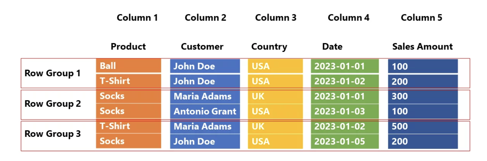
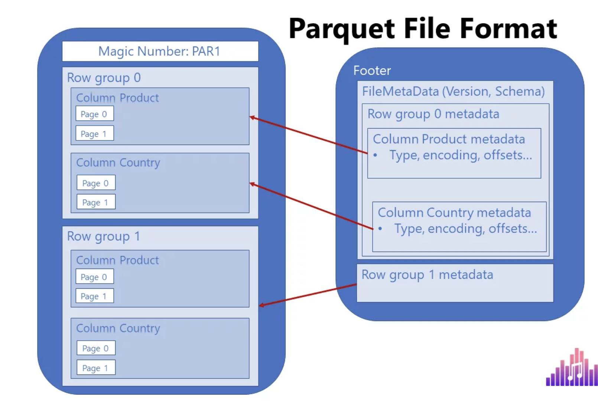
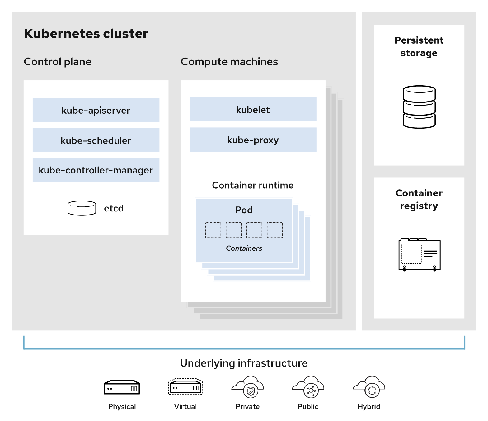

## Miscellaneous

## Data Idempotency 

**Idempotent** is an adjective to describe a process that gives you the **same result no matter how many times** you run it.

For a mathematical example, **adding 1 changes** the results, but **multiplying by 1 is idempotent**. When you add 1 to a 
number and then add 1 again, you get different results. If you multiply a number by 1 and multiply by 1 again, you do get the 
same result.

A more real-world example of idempotency is the process of saving a file in a word processor. Given the same inputs 
(i.e. the same document contents), clicking **"Save"** one time will leave your system in the exact same state as
clicking "Save" five times in a row.

This can come to mean that: running a **data pipeline multiple times** with the same input will always produce the same output.

Rerunning a data pipeline can **create duplicate data** or **fail to remove stale** data. Making a data pipeline
**idempotent can prevent** these.

## Parquet file format

Link : https://data-mozart.com/parquet-file-format-everything-you-need-to-know/

1. **Data compression** – by applying various encoding and compression algorithms, Parquet file provides reduced memory 
   consumption
2. **Columnar storage** – this is of **paramount importance in analytic** workloads, where **fast data** read operation 
   is the key requirement.
3. **Language agnostic** – as already mentioned previously, developers may use different programming languages to 
   manipulate the data in the Parquet file
4. **Open-source format** – meaning, you are not locked with a **specific vendor**
5. Support for **complex data types**

**Row scan comparision**

Search Query : how many users from the USA bought T-Shirt



1. **Row store** – the engine needs to scan all 5 columns and all 6 rows
2. **Column store** – the engine needs to scan 2 columns and all 6 rows
3. **Column store with row groups**(Parquet) – the engine needs to scan 2 columns and 4 rows

Now, the fair question would be: how Parquet “knows” which row group to skip/scan? 

**Parquet Metadata**

This means, every Parquet file contains “data about data” – information such as **minimum and maximum values** in the
specific column within the **certain row group**. Furthermore, every Parquet file contains a **footer**, which keeps 
the information about the **format version, schema information, column metadata,** and so on. You can find more details
about Parquet metadata types here.

Important: In order to **optimize the performance** and eliminate unnecessary data structures (row groups and columns), the 
engine first needs to **“get familiar”** with the data, so it first reads the metadata. It’s not a slow operation, but it still 
requires a **certain amount of time**. Therefore, if you’re querying the data from multiple small Parquet files, query 
performance can degrade, because the engine will have to **read metadata from each file**. So, you should be better 
off **merging multiple smaller files** into one bigger file (but still not too big:)



**Compression**

There are two main encoding types that enable Parquet to compress the data and achieve astonishing savings in space:
1. **Dictionary encoding** – Parquet creates a dictionary of the distinct values in the column, and afterward 
   **replaces “real” values with index values from the dictionary**.
2. **Run-Length-Encoding with Bit-Packing** – when your data contains many repeating values, **Run-Length-Encoding** (RLE) 
   algorithm may bring additional memory savings. 

**Delta Lake**

**Delta Lake** is nothing else but the Parquet format **“on steroids”**. When I say “steroids”, the main one is the
**versioning of Parquet files**. It also stores a **transaction log**, to enable keeping the track of all changes applied
to the Parquet file. This is also known as **ACID-compliant transactions**.

Since it supports not only ACID transactions, but also supports **time travel (rollbacks, audit trails, etc.)** and 
**DML (Data Manipulation Language) statements, such as INSERT, UPDATE and DELETE,** you won’t be wrong if you think of the
**Delta Lake as a “data warehouse on the data lake”**

## Docker

Docker is a set of platform as a service (**PaaS**) products that use **OS-level virtualization** to deliver software
in packages called **containers**. The software that hosts the containers is called **Docker Engine**.

Docker is a tool that is used to **automate the deployment of applications** in **lightweight containers** so that 
applications can work efficiently in **different environments in isolation**. 

**docker-compose**

```yaml
---
version: "3"

services:
  db:
    image: postgres:13
    ports:
      - "5432:5432"
    environment:
      - POSTGRES_USER=loan-monitor
      - POSTGRES_PASSWORD=postgres
      - POSTGRES_DB=loan-monitor
```

**dockerfile**

```bash
FROM python:3.9-slim

ENV PYTHONDONTWRITEBYTECODE 1
ENV PYTHONUNBUFFERED 1
ENV DOCKERIZE_VERSION=v0.6.1
ENV PYTHONPATH=.
ENV APP_DIR=/app/src/
ENV APP_USER=app

RUN mkdir -p ${APP_DIR} && \
    useradd ${APP_USER} -d ${APP_DIR} && \
    chown -R ${APP_USER} ${APP_DIR}

USER $APP_USER
WORKDIR $APP_DIR

RUN pipenv install --dev

COPY . $APP_DIR

ENTRYPOINT ["pipenv", "run"]
CMD ["uvicorn", "sample_api.main:app", "--host", "0.0.0.0", "--port", "8000", "--workers", "4"]
EXPOSE 8000
```

## Kubernetes

https://www.redhat.com/en/topics/containers/what-is-kubernetes

Kubernetes (also known as k8s or “kube”) is an open source container orchestration platform that **automates** many of
the manual processes involved in **deploying, managing, and scaling containerized** applications.

The primary advantage of using Kubernetes in your environment, is that it gives you the 
**platform to schedule and run containers** on clusters of physical or virtual machines (VMs).

With Kubernetes you can:
1. **Orchestrate containers** across multiple hosts.
2. Make better use of hardware to **maximize resources** needed to run your enterprise apps.
3. Control and **automate application deployments** and updates.
4. **Mount and add storage** to run stateful apps.
5. **Scale containerized applications** and their resources on the fly.
6. **Declaratively manage services**, which guarantees the deployed applications are always running the way 
   **you intended** them to run.
7. **Health-check and self-heal** your apps with autoplacement, autorestart, autoreplication, and autoscaling.

**Components**
1. **Control plane**: The collection of processes that control Kubernetes nodes. This is where all task assignments originate.

2. **Nodes**: These machines perform the **requested tasks** assigned by the control plane.

3. **Pod**: A group of **one or more containers** deployed to a single node. All containers in a pod 
   **share an IP address, IPC, hostname, and other** resources. Pods **abstract network and storage** from the underlying container. This lets you **move containers** around the cluster more easily. It is the **smallest entity in K8s**.

4. **Replication controller**:  This controls how many identical copies of a pod should be running somewhere on the cluster.

5. **Service**: This decouples work definitions from the pods. Kubernetes service proxies automatically get service requests to the right pod—no matter where it moves in the cluster or even if it’s been replaced.

6. **Kubelet**: This service **runs on nodes**, reads the **container manifests**, and ensures the defined containers
   are **started and running**.

7. **kubectl**: The **command line** configuration tool for Kubernetes.



## K8 Job
A job in Kubernetes is a **supervisor for pods** that run for a certain time to **completion**, for example a 
calculation or a backup operation. Let's create a job named "countdown" that supervises a pod counting from 9 down to 1:

```shell
kubectl apply -f https://github.com/openshift-evangelists/kbe/raw/main/specs/jobs/job.yaml
```

The **job definition** is listed under the resource type job:

```shell
kubectl get jobs
```

**A job is executed as a pod**. Unlike most pods, however, the pod spawned by a job **does not continue to run**, but will 
instead reach a "Completed" state. Below is an example output of the kubectl get pods command after a job has run. 

```shell
NAME              READY   STATUS      RESTARTS   AGE
countdown-dzrz8   0/1     Completed   0          55s
```

K8s Orchestration functonalities
1. Registry
2. Networking
3. Storage
4. Security
5. Telemetry

--------------------------------------------------------

## Python is dynamically typed. 

In Python 3, there is only one type **“int” for all** type of integers. 
In Python 2.7. there are two separate types **“int” (which is 32 bit)** and **“long int” that is same as “int”** of Python 3.x,

Python is different in that it **dynamically adjusts the number of bits** based on the value to be stored.
Python’s integers can keep growing in size as long as your **machine has memory** to support it. 
This is referred to as **“arbitrary precision.”**

The **sys.maxsize** property represents the max value of an integer that can be used as an **index** for Python’s 
built-in data structures, such as **lists and strings**.
The exact value of **sys.maxsize** is usually **2^31 – 1 on a 32-bit platform and 2^63 – 1** on a 64-bit platform. 

```python
positive_infinity = float('inf')

import math
positive_infinity = math.inf

from decimal import Decimal
positive_infinity = Decimal('Infinity')
```

--------------------------------------------------------

## Pytest 

```python
import pytest
def add(a, b):
    return a + b

def test_always_passes():
    assert True
    
def test_add():
    assert add(4, 5) == 9
    
@pytest.fixture
def example_fixture():
    return 1

def test_with_fixture(example_fixture):
    assert example_fixture == 1
```

```bash
pytest filename.py
```
